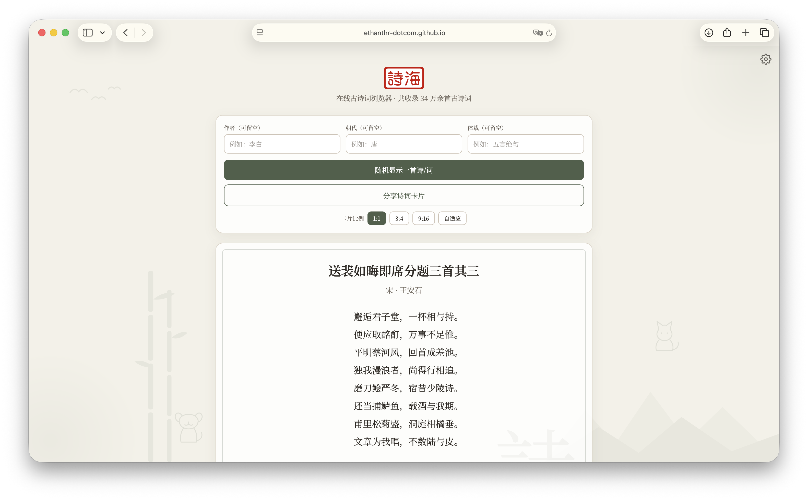
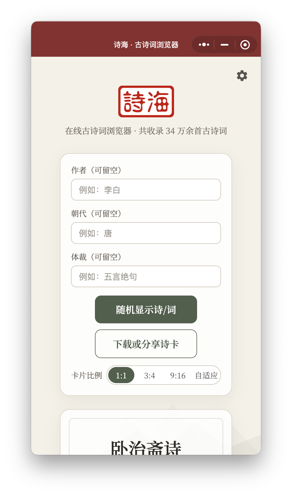
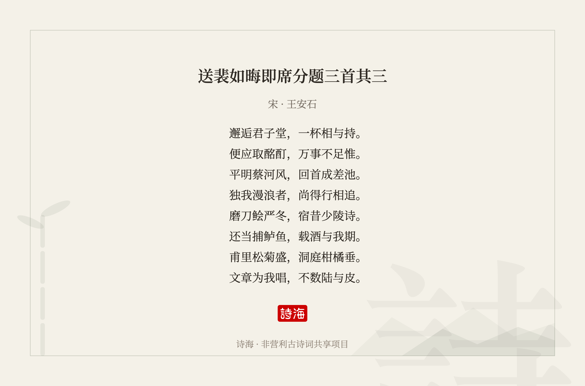

# 🌊 诗海 · The Poetry Ocean

一个面向中文古典诗词的开源数字化展示项目——收录 **344,240 首古诗词**，纯前端静态网站，无服务器、无后端依赖，通过现代 Web 技术让千年诗意重新被看见。

<p align="center">
  
  
  
</p>

## 🚀 Online Demo

**网页端**：https://ethanthr-dotcom.github.io/poetry-site/

**小程序 / 多端应用**：微信扫码体验

<p align="center">
  
</p>

> 线上数据经 jsDelivr CDN 分发，国内访问友好。

## 📖 Story Behind The Poetry Ocean

在信息快速流动的今天，我们每天接触大量文字，却越来越少停下来阅读那些跨越千年的诗句。

中国古典诗词曾记录过无数人的情感：
有杜甫忧国忧民的沉吟，有李白仗剑远游的豪情，有苏轼面对人生风雨时的旷达。
然而，许多珍贵的诗词资源仍停留在数据库或传统文本中，与现代读者之间存在距离。

因此，我创建了「诗海」——希望通过现代互联网技术，让这些古老的文字拥有新的呈现方式。
诗海不仅是一个诗词展示网站，更是一场关于传统文化与数字时代相遇的探索。

> 当代码遇见诗歌，当数据承载文明，
> 那些曾经被吟诵千年的文字，依然可以在今天的世界里继续闪耀。

## ✨ Features

- **随机抽诗**：「与诗相逢」一键随机展示一首古诗词
- **每日一首**：「今日之诗」按日期确定性推荐，所有人当天同读一首；顶栏时钟图标查看最近读过（本地保留 20 首，可重读 / 清空）
- **手势操作**：诗词卡片左右轻滑换一首随机诗、双击卡片快速收藏、长按诗句复制该句
- **智能搜索**：单一搜索框 + 方式切换（智能识别 / 按作者 / 按朝代 / 按标题，可在设置面板中设定默认方式）；智能模式下自动识别输入的是作者、朝代还是标题并实时提示；作者 / 朝代精确、标题模糊，与体裁任意组合；体裁全量（1479 项）内嵌代码零等待：常见体裁胶囊直达，「全部」展开分组面板（常见 / 诗 / 词牌·曲牌）可搜索，首项「无」表示不限
- **搜索体验**：检索过程实时显示进度（已扫描数据块 / 命中数量），数据块并行加载提速；命中的关键词在结果标题与作者行加粗高亮（搜索引擎式）；点开过的条目标记「已读」便于区分；标题模糊检索经离线字符摘要索引（search-index.json）收窄数据块、并行预取，速度大幅提升；识别结果以徽章 + 短说明呈现
- **本地收藏夹**：诗词旁点星星一键收藏（星星绽放迸溅动画），收藏夹抽屉支持批量管理 / 删除；收藏存于本机本地缓存（cookie / storage），支持一键导出全部收藏
- **批注本**：诗词旁点纸笔图标写下读诗感悟（每首一条，可编辑删除），批注本抽屉支持批量管理 / 删除；批注可与全诗同框生成分享卡片（批注大、诗词小，比例在生成卡片时选择），保存后可记忆是否生成卡片（保存后的生成卡片提醒可在设置 →「批注卡片提醒」中关闭）；批注同样存于本机本地缓存（cookie / storage）
- **搜索结果列表**：就地替换诗词卡片，手风琴式单首展开（展开后自动垂直居中）、滑动过渡，支持复选框批量收藏，触底自动翻页；列表内可直接为选中诗词生成卡片，无需跳回主页
- **精致体验**：点按水墨涟漪、卡片纸纹理、顶部阅读进度条；设置可选主题小预览（配色按钮带小色点）、摇一摇抽诗、名句速览（只展一句，可点开全诗）；分享卡片支持自定义签名行；卡片下方可复制全诗、朗读（网页端语音合成）；点作者名直达该作者全部诗词；搜索框下自动记录最近搜索（可一键清空）、收藏夹内支持搜索；今日提示附带二十四节气问候；指南面板展示阅读统计（已读数 / 到访天数 / 连续天数）；搜索无结果给出引导文案；首次到访聚光引导（30 天未访再次提示）；数据分块加载失败自动重试 3 次；网页标签页标题同步当前诗词
- **使用指南**：顶部灯泡图标呼出功能介绍；全部按钮带按压缩放回弹与触感震动反馈，所有浮层关闭均有退场动画；诗词卡片水墨入场，首条提示按时段（晨读 / 夜读等）变换
- **数据说明**：查询界面内联提示「□」为古籍原始数据缺损或字体未收录，属正常现象非程序错误
- **16 种主题配色** + 三种排版（居中 / 宽屏 / 紧凑），CSS 变量驱动即时切换；设置面板分「主题样式 / 体验开关」两组可折叠，选项等宽对齐
- **横排 / 竖排**双方向阅读；竖排自动推荐 56 字以内的短诗
- **高清分享卡片**：Canvas 手绘生成，支持 1:1 / 3:4 / 9:16 / 自动比例
- **原生分享**：支持「分享给朋友」与「分享到朋友圈」（安卓端），分享携带诗词深链，好友点开直达同一首诗
- **按需加载**：345 个数据分块 + 两级索引，首次访问仅加载 18KB
- **防溢出排版**：任何文字触碰边框即按规则折行，全设备自适应
- **微信小程序 / 多端应用**：与网页端功能完全对等，数据经微信云开发云函数分发，免域名备案
- **逐字挥毫式开屏**：座右铭「掬古人之诗·养今时之心」逐字浮现，点击可跳过
- **首次使用提示**：底部抽屉式数据来源与免责说明，同意后直进主页
- **隐藏开发者面板**：小程序长按设置齿轮 5 秒、网页长按页脚版权行呼出；分「应用 / 设备与系统 / 数据与存储 / 运行状态」四区实时刷新（设备型号、电量、本地存储用量、收藏与批注条数、字体 / 主题 / 网络状态、JS 堆内存等），支持一键复制全部信息、重新显示开屏使用提示

## 🛠️ Tech Stack

### 架构概览

```
网页端    浏览器 ──► 单文件 index.html ──► data/*.json（本地相对路径 / jsDelivr CDN）
小程序端  页面 ──► wx.cloud.callFunction ──► poemData / poemData2（数据 gzip 打包在函数内）
```

| 部分 | 技术 |
|---|---|
| 网页端 | 单文件 `index.html`（原生 HTML/CSS/JS，零框架零构建） |
| 主题系统 | CSS 自定义属性（变量）动态注入，16 配色 × 3 排版即时切换 |
| 分享图 | Canvas 2D 逐字手绘排版，横/竖版双布局 |
| 字体 | Noto Serif SC（思源宋体），`wx.loadFontFace` 页面 + 分享图双端生效，jsDelivr → unpkg 双 CDN 降级 |
| 数据分发 | jsDelivr CDN（网页）/ 微信云开发云函数（小程序，gzip 打包） |
| 小程序 | 微信原生小程序 + 多端应用，Web 端功能完整移植 |
| 数据管线 | Python：繁简转换（zhconv）、乱码清理、切片、两级索引 |

### 仓库结构

```
.
├── index.html          # 网站本体（单文件，含全部 CSS/JS）
├── project.config.example.json # 开发者工具配置模板（复制为 project.config.json 后填自己的 appid）
├── data/               # 345 个数据分块 + 两级索引（约 90MB）
├── assets/             # logo / 图标
├── tools/              # 语料转换脚本
├── miniprogram/        # 微信小程序源码
└── cloudfunctions/     # 数据云函数（poemData / poemData2，数据已 gzip 打包）
```

### 本地部署

#### ① 网页版（30 秒）

只需任意静态文件服务器：

```bash
git clone https://github.com/ethanthr-dotcom/shihai-the_poetry_ocean.git
cd shihai-the_poetry_ocean
python3 -m http.server 8080
```

浏览器打开 http://localhost:8080/ 即可。
站点会自动识别本地环境（`IS_LOCAL`），直接从相对路径 `data/` 按需加载分块，不走 CDN；部署到任意静态托管（GitHub Pages / Cloudflare Pages 等）时自动切换为 jsDelivr 数据源，无需改代码。

#### ② 微信小程序（云开发模式）

前置：微信开发者工具、自己的小程序 AppID、已开通云开发环境。

1. 在开发者工具中新建一个「云开发」模板项目；
2. 把 `project.config.example.json` 复制为 `project.config.json`（该文件含个人 appid，已被 .gitignore 忽略、不入库），再用开发者工具「导入项目」选择本仓库根目录，并把配置里的 `appid` 换成你自己的；
3. 打开「云开发」控制台 → 设置 → 环境：
   - 记下**环境 ID**，填入 `miniprogram/utils/config.js` 的 `CLOUDBASE_ENV`；
   - 在「环境访问权限」中添加你的 AppID；
4. 分别右键 `poemData`、`poemData2` → **上传并部署：所有文件**（约 17MB / 24MB，各需一两分钟）；
5. 编译运行，随机抽诗即走云函数取数（启动时自动预热两个函数）。

> 为什么是两个云函数？微信云函数部署包上限 50MB，345 个分块（gzip 后约 40MB）拆成 001–140 与 141–345 两个函数，小程序按分块号自动路由（`CLOUDBASE_SPLIT = 140`）。云函数内读取时即时 `gunzip` 并做内存缓存。

#### ③ 纯本地调试模式（可选，免云开发）

不想开通云开发也能跑小程序：修改 `miniprogram/utils/config.js`：

```js
const DATA_MODE = "http";
const USE_LOCAL = true;   // 数据改从 http://127.0.0.1:8765/ 读取
```

然后在仓库根目录运行 `python3 -m http.server 8765`，并在开发者工具「详情 → 本地设置」勾选 **不校验合法域名**。

#### ④ 重新生成数据

```bash
pip3 install zhconv   # 仅首次
python3 tools/convert_chinese_poetry.py
```

## 📚 Data Source

诗词数据来源于开源项目 [chinese-poetry/chinese-poetry](https://github.com/chinese-poetry/chinese-poetry)（MIT License），涵盖全唐诗、全宋诗、宋词、元曲、五代诗词、楚辞、诗经、曹操、纳兰性德等。

诗海对原始语料进行了重新整理，以适应纯前端静态网站的按需加载：

- 繁体统一转换为简体
- 清理 PUA 码位与乱码字符
- 切分为 345 个分块（每块 1000 首，共约 90MB），配合两级索引懒加载

```
data/
├── index.json       # 精简索引（file/count/dynasties，18KB）
├── index-full.json  # 筛选索引（额外含 authors/types，324KB）
├── 001.json         # 345 个分块，每块 1000 首
├── 002.json
└── ...345.json
```

每个分块的诗词对象使用短键名：

| 键 | 含义 | 键 | 含义 |
|---|---|---|---|
| `t` | 标题 | `d` | 朝代 |
| `a` | 作者 | `y` | 体裁 |
| `c` | 正文 | | |

重新生成数据：

```bash
pip3 install zhconv   # 仅首次
python3 tools/convert_chinese_poetry.py
```

## 📜 License

本项目源代码采用 **MIT License** 开源（见 [LICENSE](LICENSE)）。

诗词数据来源于 chinese-poetry/chinese-poetry（MIT License）；诗海对其进行了重新整理、切片、索引与字符清理，第三方内容的许可证以其原始项目声明为准，详见 [THIRD-PARTY-NOTICES.md](THIRD-PARTY-NOTICES.md)。

诗海是一款非营利古诗词阅读与检索工具，相关内容仅供阅读、学习与研究参考。
